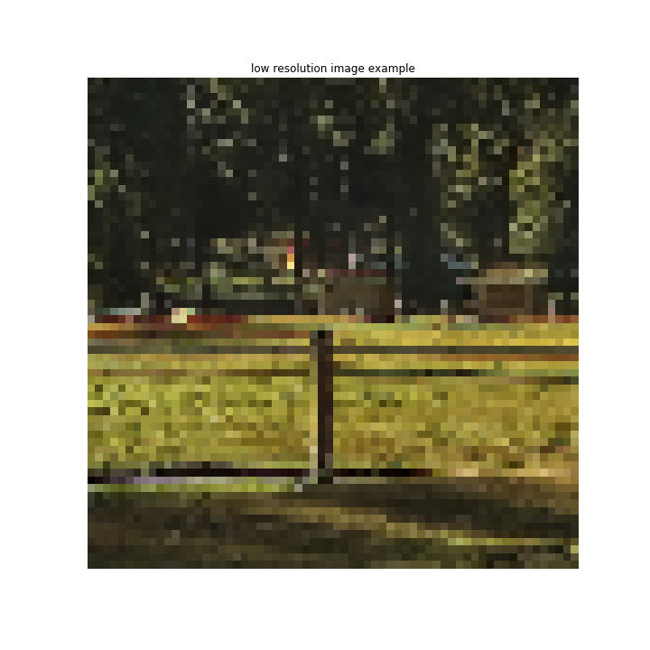
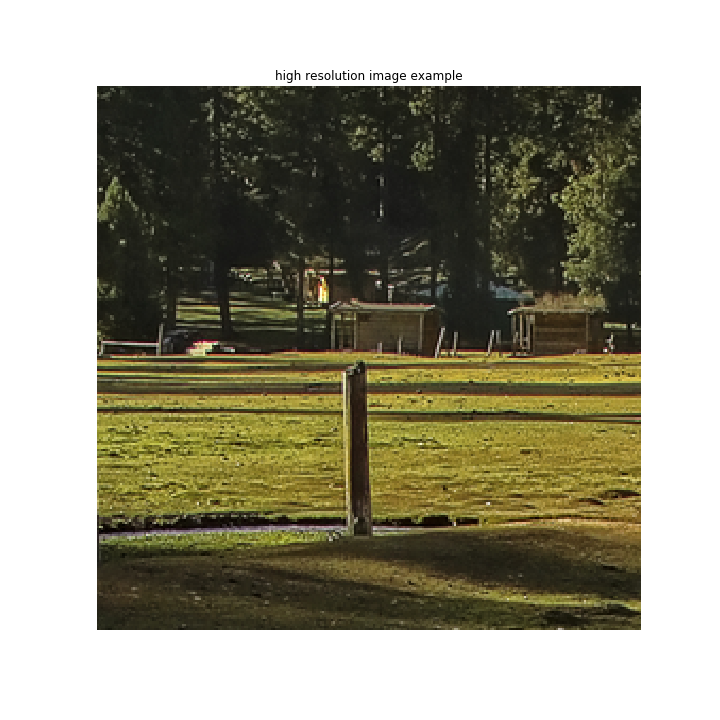
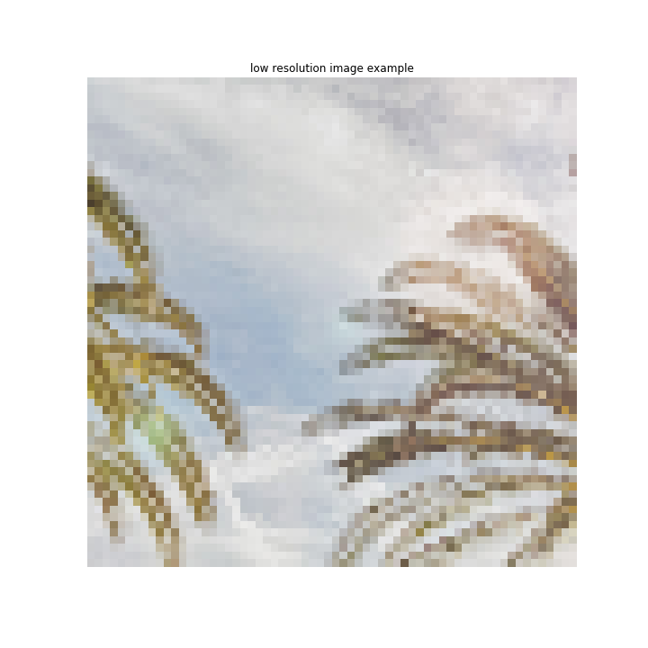
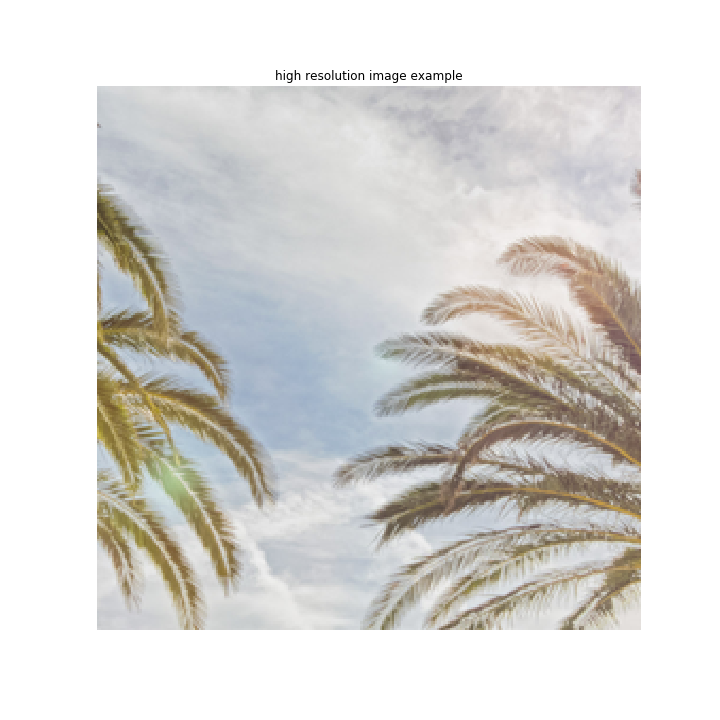
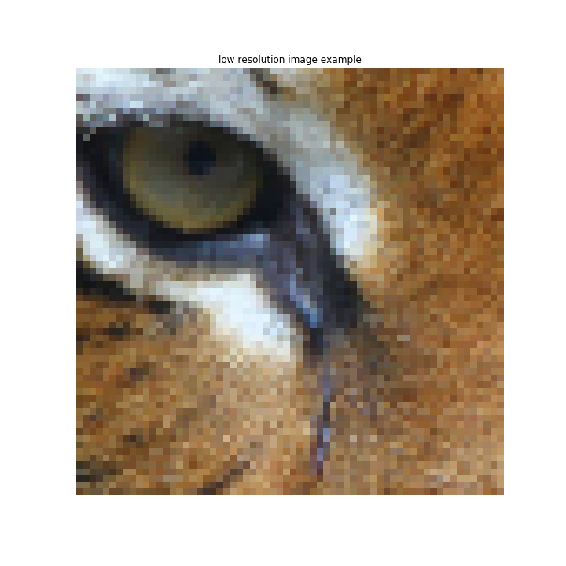
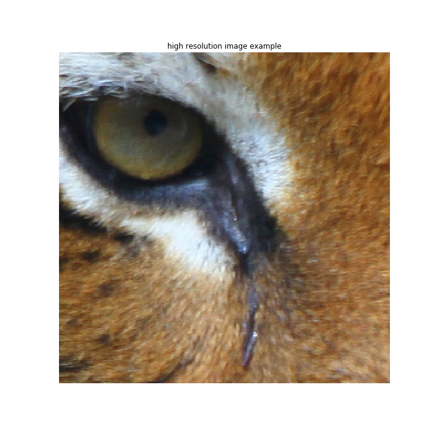

# Title: Super Resolution of images using SRGAN

#### Authors : Srikanth Babu Mandru

#### *Proposed as "Quantiphi Project"*

## Summary 

Data being like the modern world's electricity, it's driving as fuel in many applications ranging from Medical, Industries, Businesses. One of the major issues with systems depending on data is "DATA" itself. There might be a lot of discrepancies in the quality of data available to use. This is true, especially in the computer vision field, where the images or videos available for the use are not up to the requirement and resulting in low efficiencies of the systems. As the data and technology evolve, there is need for a technique that makes this data act as a power-fuel for improving the efficiencies of existing or other techniques used for different applications. For all the computer vision-related problems, the images or videos that we feed into systems makes a huge deal in alleviating the overall performance. Thus, it is essential to make the images or videos phenomenal for the successful accomplishment of our tasks. So, this project exactly tries to solve the same problem. It is a highly challenging task to estimate a high-resolution (HR) image from its corresponding low-resolution (LR) image and this process of resolving the image is often referred to as a 'Super-Resolution (SR)' problem. 'Super-Resolution' received huge attention from within the computer vision research community in the recent years and has a wide range of applications such as Autonomous vehicle driving, Face Recognition or verification, video resolution tasks, Medical Imaging, Security Systems, Gaming and Graphics design and more.

Initially, the project aims at implementing the SRGAN model to solve Super Resolution(SR) problem and then take it to large scale data training using google cloud. I took a dataset named 'DIV2K' [Dataset link], which is one of the popular datasets for image resolution tasks. 'DIV2k' dataset constitutes of 800 training, 100 validation, and 100 test images. Later, I try to incorporate other datasets for training so that the model becomes more robust. After dealing with the images, I will proceed to work with videos based on the availability of datasets.

## Proposed plan of research

This project focuses on solving the SR problem through 2 phases. First phase of project is to explore the ideas of GAN architectures and to understand the merits of using SRGAN. At this phase, I will also concentrate on developing SRGAN model using the Tensorflow, Keras and other Machine learning APIs. In the second phase, I will take the training of model to google cloud platform using the google storage and compute engines. Over the entire project cycle, I will do some research on building other architectures for improving the performance of SR by strongly focusing on Deep learning techinques. 

As a metric to evalute, there are two options available, namely 'Peak-Signal-to-Noise-Ratio (PSNR)' and 'Mean-Opinion-Score (MOS)'. While the 'PSNR' is mostly used for evaluation in image processing, it does not correlate with the perceptual quality of image and does not capture the essence of perception that is more obvious for human to interpret. So, I will consider to take 'MOS' as the evaluation metric (which is similar to giving ratings). This way, we could get better super resolved images. 

General GAN block diagram is shown in following figure: 

Generator and discriminator network architectures in SRGAN are as shown in below figure:

## Preliminary Results

As the preliminary steps, I have implemented most of the image preprocessing part of project so that images data fits to our model seamlessly. The steps that I have followed are as follows :

- The actual original images are of size (2048, 1080, 3)

- Cropped the original images to size (256, 256, 3) ( different from shape in SRGAN paper)

- Now, discriminator input will be of shape (256, 256, 3) and generator input is (64, 64, 3) which is downsampled version of discriminator input using "bicubic" kernel with factor of "4"   

Some of the sample low and high resolution images that are obtained from preprocessing steps are as shown in below figure:

  

  

 

## References

[1] C. Ledig, L. Theis, F. Husza ́r, J. Caballero, A. Cunningham, A. Acosta, A. P. Aitken, A. Tejani, J. Totz, Z. Wang et al., “Photo-realistic single image super-resolution using a generative adversarial network,” in CVPR, 2017. [(SRGAN)](https://arxiv.org/abs/1609.04802)

[2] Zhihao Wang, Jian Chen, Steven C.H. Hoi, Fellow, "Deep Learning for Image Super-resolution: A Survey", IEEE, 2019.

**Advantages of Super-Resolution:**
 
- It saves the storage space of images and provides high resolution images whenever needed

- Adapts to new hardware upgrades(like improved screen resolution of TV, Theatre, etc)

- Make objects to be highly distinguishable in images so that data in whole will be useful for our tasks.
